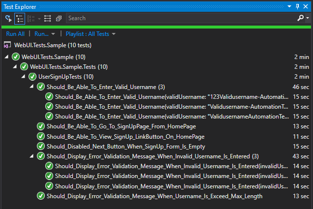
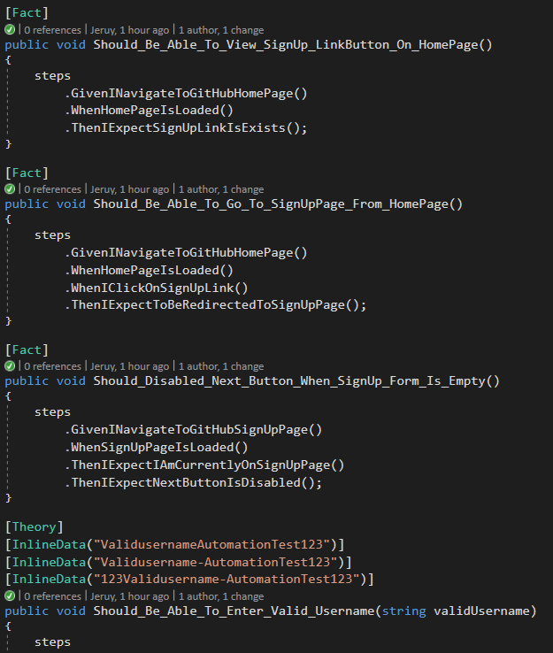

[](https://dev.azure.com/azrul-jeruy/jeruy-github/_build/latest?definitionId=4&branchName=master)

# Introduction 
Hello World~! This repo is to host my sample code for my [gig](https://www.fiverr.com/share/oDZ7V) in fiverr. This sample test code is how I implement web UI test automation using Selenium, .Net Core and xUnit. Feel free to clone this repo and extend the tests for your own testing requirements.

There are 10 sample tests that I automate to test GitHub's registration/join page. The tests are :

 1. ```Should_Be_Able_To_View_SignUp_LinkButton_On_HomePage```
 2. ```Should_Be_Able_To_Go_To_SignUpPage_From_HomePage```
 3. ```Should_Disabled_Next_Button_When_SignUp_Form_Is_Empty```
 4. ```Should_Be_Able_To_Enter_Valid_Username(validUsername: "ValidusernameAutomationTest123")```
 5. ```Should_Be_Able_To_Enter_Valid_Username(validUsername: "Validusername-AutomationTest123")```
 6. ```Should_Be_Able_To_Enter_Valid_Username(validUsername: "123Validusername-AutomationTest123")```
 7. ```Should_Display_Error_Validation_Message_When_Invalid_Username_Is_Entered(invalidUsername: "~!@#$%^&*(")```
 8. ```Should_Display_Error_Validation_Message_When_Invalid_Username_Is_Entered(invalidUsername: "!@#$%Invalidusername-AutomationTest")```
 9. ```Should_Display_Error_Validation_Message_When_Invalid_Username_Is_Entered(invalidUsername: "Invalidusername-AutomationTest123!@#$%")```
 10. ```Should_Display_Error_Validation_Message_When_Username_Is_Exceed_Max_Length```
 
 

# Getting Started
The test methods are using extensible steps class and follow [fluent interface](https://martinfowler.com/bliki/FluentInterface.html) and applying [BDD](https://en.wikipedia.org/wiki/Behavior-driven_development) style [Given-When-Then](https://martinfowler.com/bliki/GivenWhenThen.html) convention to increase tests readability.  

The selenium pages in this project are following [Page Object Model](https://www.pluralsight.com/guides/getting-started-with-page-object-pattern-for-your-selenium-tests) design pattern : 

**Advantages of POM model:**

-   **Reusability:**  We can reuse the page class if required in different test cases which means we don’t need to write code for identifying the web elements and methods to interact with them for every test case.
-   **Maintainability:**  Test case and page class are different from each other which means we can easily update the code if any new web element is added or existing one updated.
-   **Readability:**  Page code is separated form test code which helps to improve code readability.

 
 
 Since this sample tests code is written in .NET Core 2.1, you can just build and run the test using [.NET Core SDK](https://dotnet.microsoft.com/download) - or if you have Visual Studio installed in your machine, you can build and run the tests from  Visual Studio's Test Explorer

# Build and running the tests locally
If you already have Visual Studio and .NET Core installed in you machine, you can follow below steps : 

**(Using [Visual Studio](https://visualstudio.microsoft.com/vs/community/))**

STEP 1 : Clone this repo to your local
STEP 2 : Open and Build the solution (```src\WebUI.Tests.Sample.sln```) in Visual Studio
STEP 3 : If the build is succeeded, you will see the list of tests in Test Explorer window
STEP 4 : Run all the tests

Youtube video for these steps could be found : [here](https://youtu.be/yxbQ6iQUuiU) 

**(Using .NET Core [SDK](https://dotnet.microsoft.com/download))** 

STEP 1 : Clone the repo to your local 
STEP 2 : Go to csproj file path (```src/WebUI.Tests.Sample```)
STEP 3 : Run "dotnet build"
STEP 4 : Run all the tests using "dotnet test" command

Youtube video for these steps could be found : [here](https://youtu.be/gOCDgAT5N88) 

# How to contribute
  1. Fork the project & clone locally.
  2. Create an upstream remote and sync your local copy before you branch.
  3. Branch for each separate piece of work.
  4. Do the work, write good commit messages.
  5. Push to your origin repository.
  6. Create a new PR in GitHub.
  7. Respond to any code review feedback. 
  (read : Rob Allen's [The beginner's guide to contributing to a GitHub project](https://akrabat.com/the-beginners-guide-to-contributing-to-a-github-project/))
  
  
  Thanks for visiting my repo.


  # About me and my [gig](https://www.fiverr.com/share/N7y5N) on [fiverr](https://www.fiverr.com/share/N7y5N)
  
I've extensive experience with the following technologies:

 - Selenium 
 - xUnit 
 - C# 
 - Angular 
 - Typescript 
 - Jasmine

If you have requirements to write a automation tests, please support my [gig](https://www.fiverr.com/share/N7y5N) at fiverr or contact me via [email](mailto:azrul81@gmail.com)
